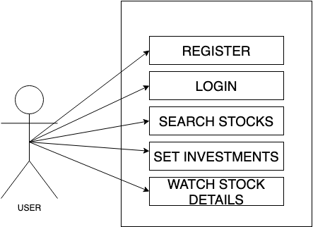
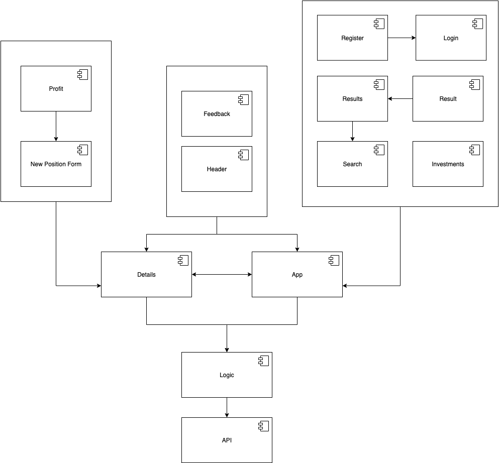

# stockDaily

## Introduction

stockDaily is a web application that allows the user to search stocks and get information about its trend today. It also can track the profit of the user's long positions

## Funftional description

### Use cases

### Flow

### Components

