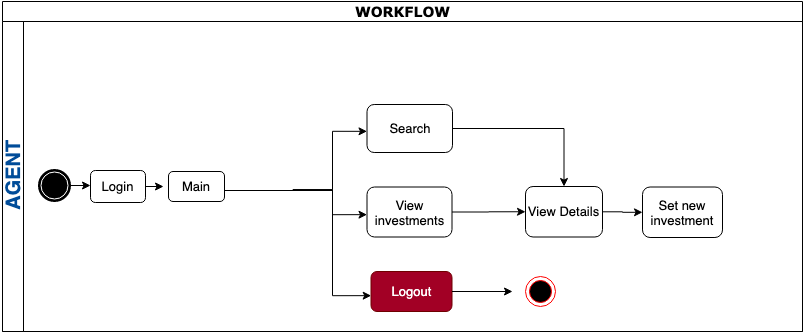
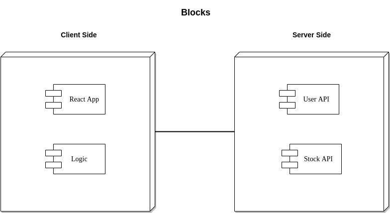
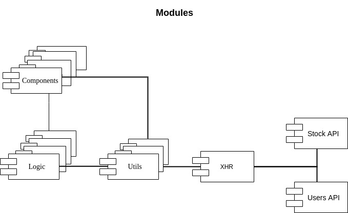
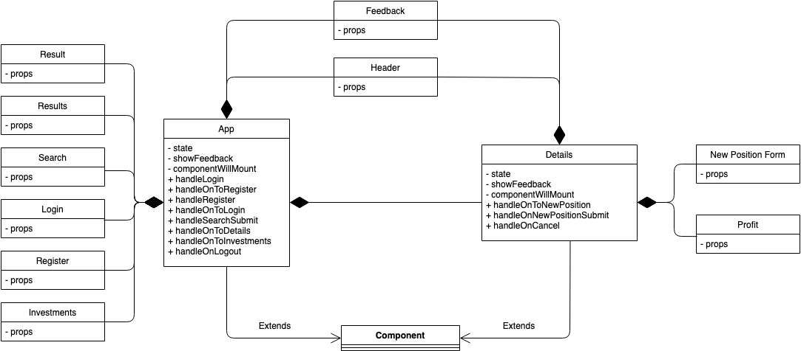
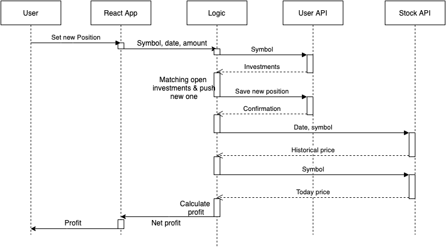
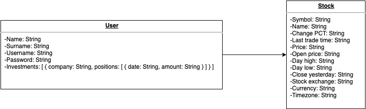

# stockDaily

## Introduction

stockDaily is a web application that allows the user to search stocks and get information about its trend today. It also can track the profit of the user's long positions

## Functional description

### Use cases

### Flow

## Technical Description

### Blocks

### Modules

### Classes

### Sequence for setting a new investment

## Data model

